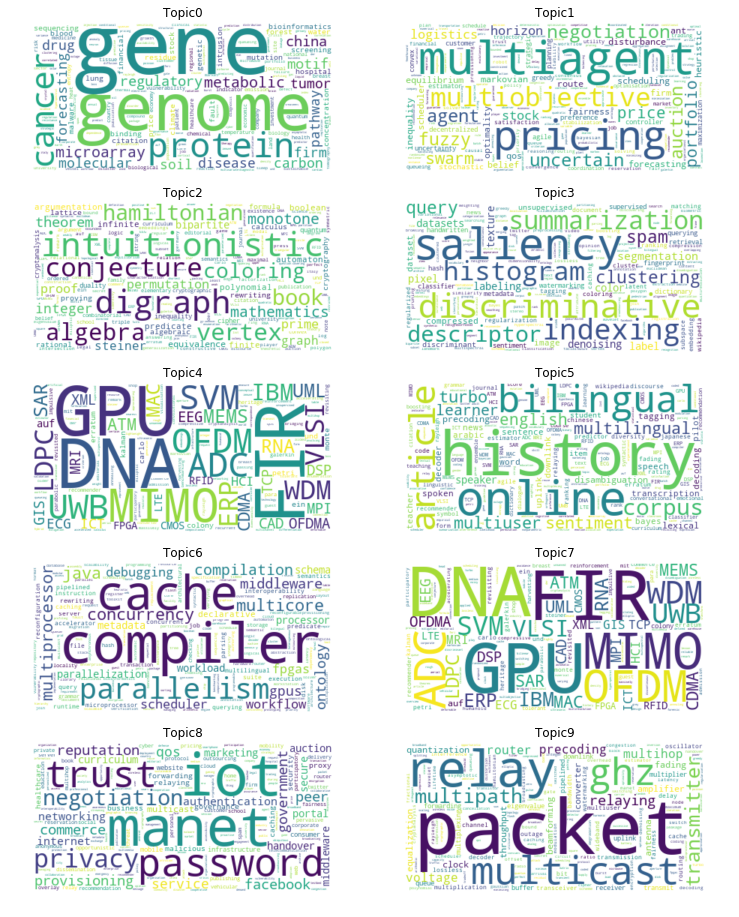

# Neural Topic Model

Training a Neural Topic Model (NTM) with [Amazon SageMaker](https://docs.aws.amazon.com/sagemaker/latest/dg/ntm.html) on AllenAI's [Open Research Corpus](https://labs.semanticscholar.org/corpus/).

## Python Notebook

[View the notebook](https://nbviewer.jupyter.org/github/jahewson/neural-topics/blob/master/neural-topics.ipynb) using nbviewer as GitHub's rendering doesn't support it properly.

